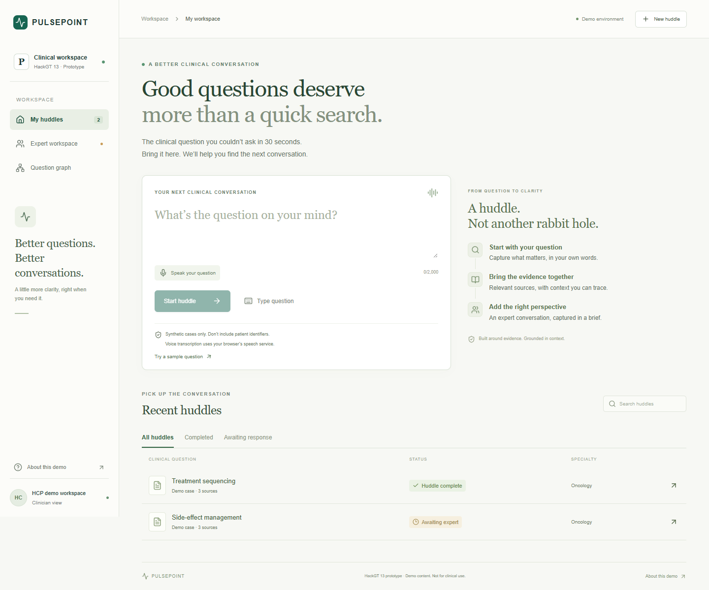
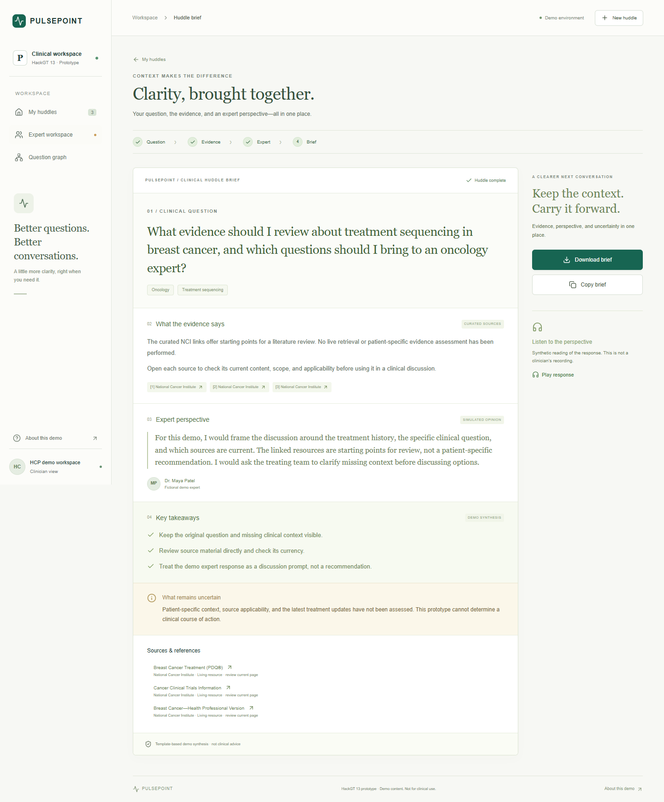
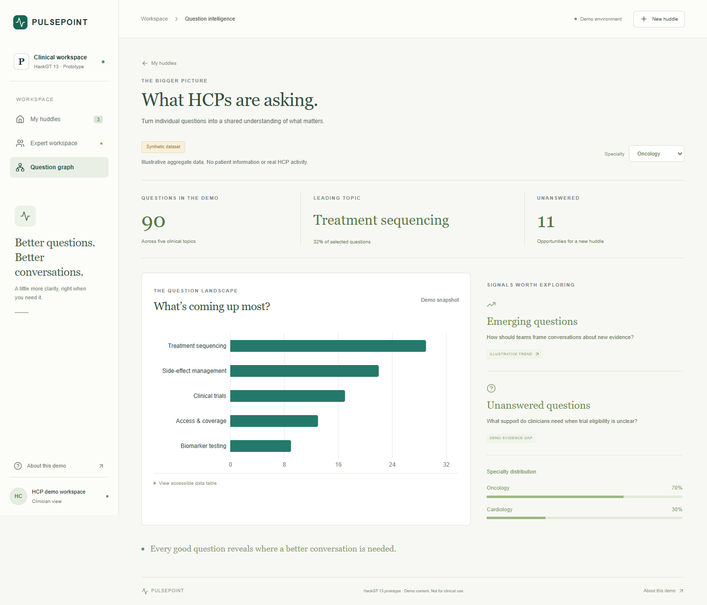

# PULSEPOINT

**The clinical question you couldn't ask in 30 seconds.**

HackGT 13 frontend prototype: question → evidence → expert perspective → Clinical Huddle Brief.

## Open and test it

Use **Visual Studio Code** as the editor, **Node.js 24 LTS** as the runtime, and Chrome or Edge as the browser. GitHub stores the source; you run the application on your computer.

1. Install [Visual Studio Code](https://code.visualstudio.com/) and [Node.js LTS](https://nodejs.org/en/download). Restart VS Code after installing Node.
2. Download this repository's branch as a ZIP and extract it, or clone it with GitHub Desktop. Open the `pulsepoint` folder in VS Code with **File → Open Folder**.
3. In VS Code choose **Terminal → New Terminal**, then run:

```sh
cd frontend
npm install -g pnpm@11.19.0
pnpm install
pnpm dev
```

4. Open **http://127.0.0.1:3000**. Keep the terminal running. Press **Ctrl+C** to stop.

If Windows blocks `npm.ps1`, choose **Command Prompt** from the terminal's dropdown and run the same commands. No PowerShell security setting needs to change.

### Fastest demo

Click **Try a sample question → Start huddle → Continue to evidence → Request huddle → Use simulated response → Create huddle brief**. Download the brief, then open **Question graph**. See [the two-minute script](docs/DEMO.md).

No API key, database, Python installation, or backend is required for the demo. Voice is optional and depends on browser support, microphone permission, and the browser's speech service; typed input always works.

## What works

- Responsive HCP workspace, question composer, extracted-context review, evidence links, expert matching, and expert response workspace.
- Browser voice-to-text for questions and responses, with explicit unavailable/permission error fallback.
- Completed briefs that separate reference material, simulated expert opinion, synthesis, and uncertainty.
- Plain-text brief download, clipboard copy, and explicitly synthetic speech playback.
- Recent-huddle search/status filters and tab-session persistence for demo cases.
- Question Graph with illustrative specialty filtering, topic chart, and accessible data table.
- Runtime-validated API adapter, timeout/error states, and explicit demo fallback.

## Screenshots





## Scope and honesty

This is a working **frontend demo**, not a clinical product. Classification is deterministic; it recognizes the seeded breast-cancer case. Unmatched questions show no evidence or expert match. Briefs use templates; no LLM, RAG, or real clinician is connected. Expert profiles, matching scores, and graph counts are fictional. NCI links are real public resources, but the app does not perform live literature retrieval or clinical validation. The frontend has no authentication or patient-data safeguards for real-world use. Use synthetic cases only.

## Team integration

The repository did not contain backend models when this frontend was created. [API.md](docs/API.md) is a **proposed contract**, not a claim of compatibility with an existing backend. Agree on it with the backend teammate before turning on live mode. The adapter and runtime schemas isolate any required changes.

```text
frontend/
  app/           Page, layout, visual system
  components/    HCP flow, expert flow, brief, graph, shared UI
  hooks/         Browser speech-to-text
  types/         Runtime schemas and inferred TypeScript types
  data/          Clearly labeled synthetic demo fixtures
  lib/           Demo/live service adapter
  tests/         Lifecycle, API failures, and browser flow checks
docs/            Architecture, API, data, safety, demo, screenshots
```

Backend, AI, and data services can be added by their owners in `backend/`, `ai/`, and `data/`. No backend architecture is imposed by this frontend.

## Checks

From `frontend/`:

```sh
pnpm typecheck
pnpm test
pnpm build
pnpm exec playwright install chromium
pnpm test:e2e
```

The browser checks cover desktop and mobile layouts, the complete huddle, export, session reload, graph filtering, unsupported questions, empty search results, voice fallback, and dialog keyboard dismissal. Screenshots are generated in `docs/screenshots/`.

## Development notes

- Dependencies are locked with `pnpm-lock.yaml`. Use Node 24 LTS; Node 22.18+ is also supported.
- Source fonts and icons require no external font/image service. Source links open only when clicked.
- Demo huddles are stored in `sessionStorage` for this tab, capped at 30. Use **About this demo → Reset demo data** to reset.
- Live mode is a development integration preview; authentication, authorization, consent, de-identification, expert verification, and clinical review must be implemented before any real use.
